# Projeto WordPress em AWS com Docker e Docker Compose

Este projeto demonstra a implantação de uma aplicação **WordPress** em uma infraestrutura escalável e resiliente na **AWS**, utilizando boas práticas de **DevOps** e segurança.  
A arquitetura foi projetada para separar as camadas de **rede**, **aplicação** e **dados**, garantindo alta disponibilidade e gerenciamento facilitado.

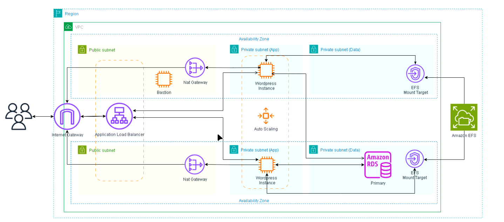

---

## 🚀 Tecnologias e Serviços Utilizados

- **Infraestrutura como Código (IaC)**: Script Bash para automação.
- **Contêineres**: Docker e Docker Compose.
- **AWS**:
  - **EC2**: Instâncias para o WordPress e Bastion Host.
  - **VPC**: Rede virtual isolada.
  - **RDS**: Banco de dados MySQL gerenciado para o WordPress.
  - **EFS**: Sistema de arquivos elástico para o diretório de uploads do WordPress.
  - **ALB**: Application Load Balancer para distribuir o tráfego.
  - **Auto Scaling**: Grupo para gerenciar a escalabilidade das instâncias.
  - **Internet Gateway & NAT Gateway**: Conectividade com a internet.
  - **Security Groups**: Controle de acesso de rede.

---

## 🏗️ Arquitetura da Solução

A arquitetura se baseia em uma **VPC** com duas zonas de disponibilidade (1a e 1b), garantindo alta disponibilidade.

### Subnets
- **2 Subnets Públicas**: Para o Bastion Host e os NAT Gateways.
- **2 Subnets Privadas de Aplicação**: Para as instâncias EC2 do WordPress, gerenciadas pelo Auto Scaling.
- **2 Subnets Privadas de Dados**: Para o banco de dados RDS e o EFS.

### Gateways
- **Internet Gateway**: Anexado à VPC, permite comunicação com a internet.
- **NAT Gateways**: Dois NAT Gateways com IPs estáticos, localizados nas subnets públicas, para permitir que as instâncias nas subnets privadas acessem a internet.

---

## 💰 Atenção aos Custos
A arquitetura descrita (**IPs estáticos** , **NAT Gateways** , **RDS** , **EFS** , **AutoScaling** , **LoadBalance**) gera custos na AWS.  
Planeje seu uso para evitar cobranças indesejadas.

---

## 📋 Guia de Instalação e Configuração

### 1. Configuração da VPC e da Rede
1. Crie uma VPC chamada **vpc-wordpress** com o IP `10.0.0.0/16` e habilite DNS.
2. Crie um **Internet Gateway** e anexe à VPC.

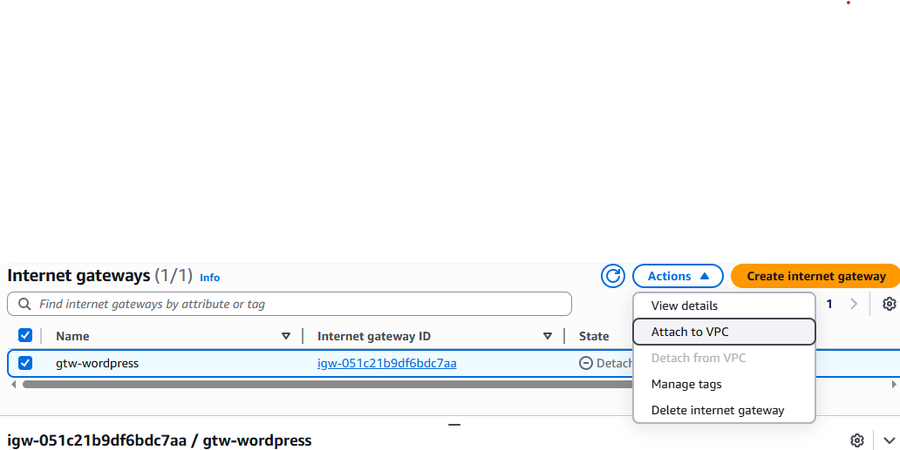

3. Crie **6 subnets**:
   - 2 pública para cada zona de disponibilidade (1a e 1b).
   - 2 privadas (app) para cada zona de disponibilidade (1a e 1b).
   - 2 privadas (data) para cada zona de disponibilidade (1a e 1b).
  
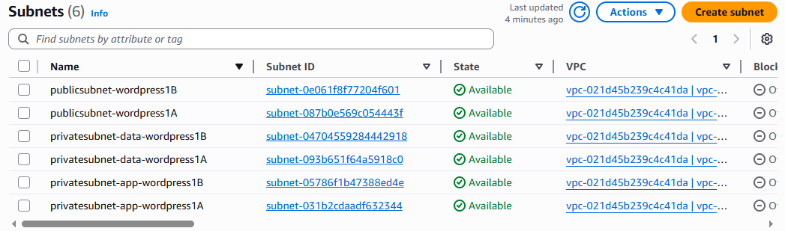

4. Crie **2 IPs estáticos**

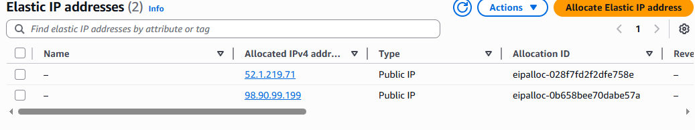

5. **2 NAT Gateways** nas subnets públicas.
Crie as nat gateways com os ip criados anteriormente.

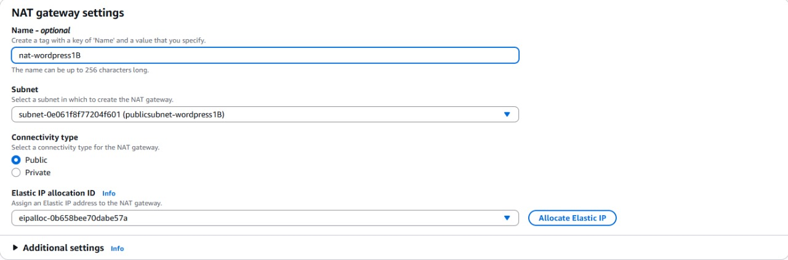
    
6. Configure as **tabelas de rotas**:
   - Subnets públicas → `0.0.0.0/0` para o Internet Gateway.

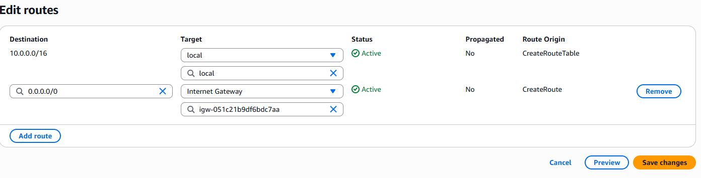

   - Subnets privadas (app e data) → `0.0.0.0/0` para os NAT Gateways.
     
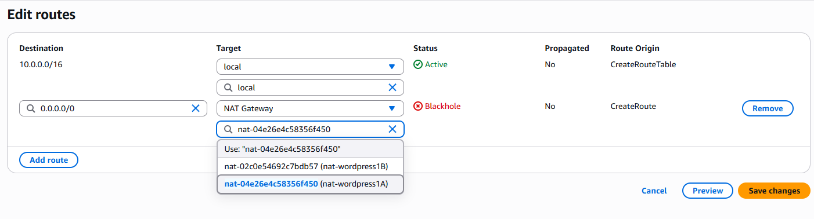

deve ficar assim:

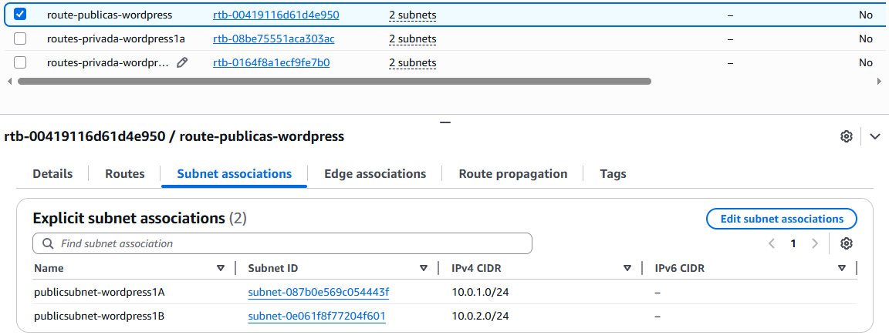

Você pode conferir a estrutura em VPC > Suas VPC > mapa de rede:

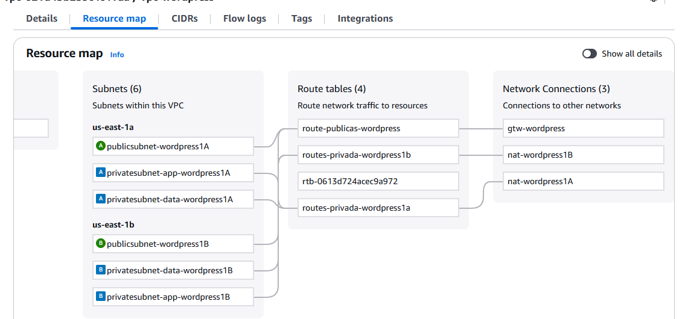

---

### 2. Criação dos Security Groups
- **Bastion Host**: 
**Regra de entrada:**
SSH port 22
Source: my ip

HTTP port 80
Source: grupo de segurança ALB

**Regra de saida:**
All traffic
Source: 0.0.0.0


- **Instância WordPress**:
**Regra de entrada:**
SSH port 22
Source: grupo de segurança Bastion
HTTP port 80
Source: grupo de segurança ALB

**Regra de saida:**
All traffic
Source: 0.0.0.0

MYSQL/Aurora port 3306
Source: groupo de segurança RDS

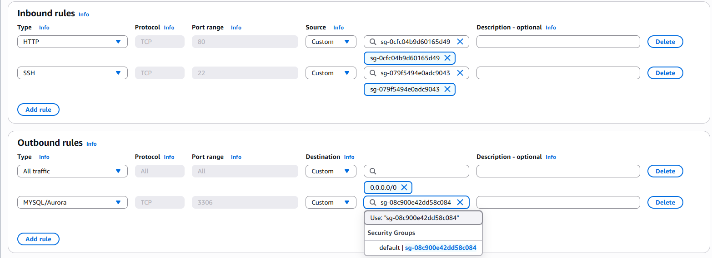

- - **LoadBalancer**:
Regra de entrada:
HTTP port 80
Source: 0.0.0.0

Regra de saida:
HTTP port 80
Source: gropo de segurança EC2

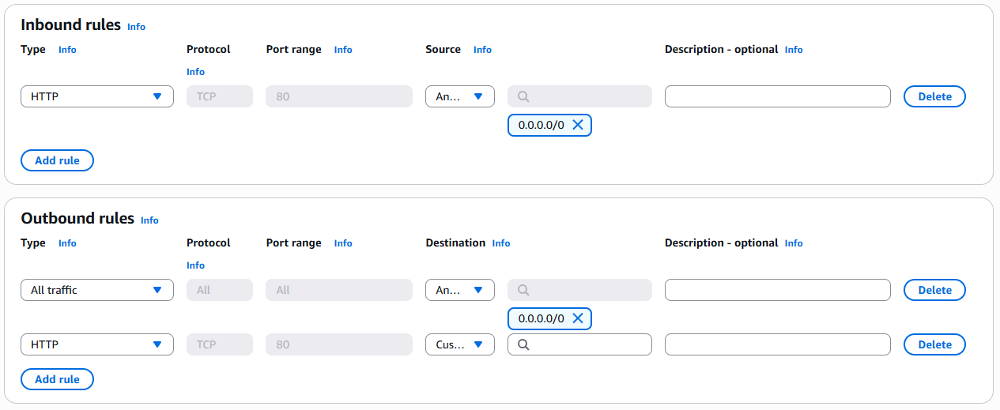
- **RDS**: Porta 3306 (MySQL), origem: SG da instância.
Regra de entrada:
MYSQL/Aurora port 3306
Source: grupo de segurança EC2

Regra de saida:
All traffic
Source: 0.0.0.0

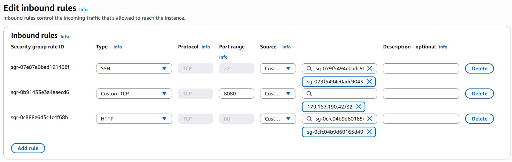
  
- **EFS**: Porta NFS, origem: SG da instância.
Regra de entrada:
NFS port 2049
Source: grupo de segurança EC2

Regra de saida:
All traffic
Source: 0.0.0.0

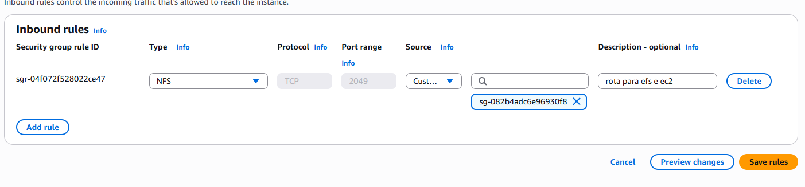

---
### 3. Criação do Grupo de subnets
Em Aurora e RDS, va para grupo de subnets e clique em criar.
1. Ecolha a VPC
2. Anexe as subnets private-data:

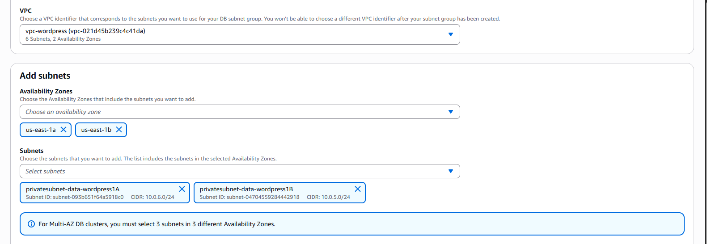

---

### 4. Criação do Banco de Dados RDS
1. Crie uma instância **MySQL**.
2. Modelo nivel gratuito. 
3. Nomeie como `wordpress-db`, usuário `admin`, senha `02teste07`.
4. Intancia tipo db.t3.micro
5. Conecte à VPC criada e desabilite acesso público.
6. Escolha o gruo de subnets criado anteriomente.
7. Escolha o segurity group criado anteriormente.
8. Zona de preferencia A.
9. Abilite logs de erro e crie o banco.

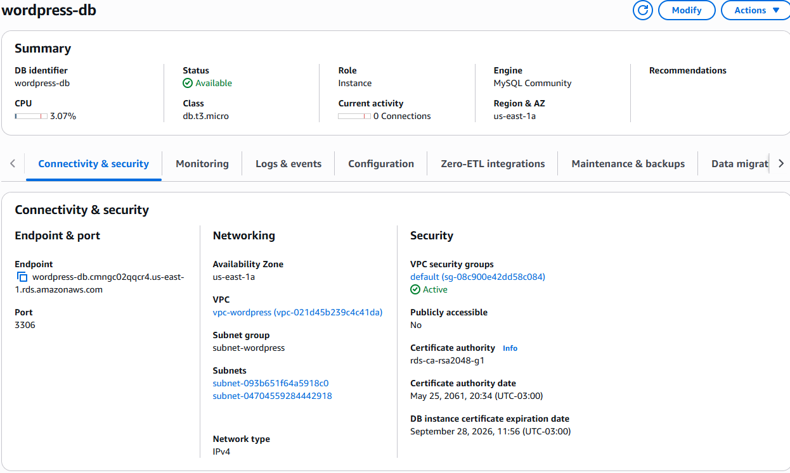

---

### 4. Criação do EFS
Em EFS clique em cria sistema de arquivos:
1. Crie um sistema de arquivos **EFS** chamado `efs-wordpress`.
2. Clique em personalizar.
3. Escolha regional.
4. Escolha a VPC e as AZ 1a e 1b, às subnets privadas-app e associe o SG do EFS.
5. E Crie.

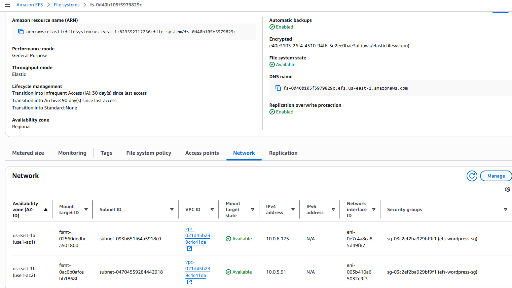

---

### 5. Configuração do Bastion Host
1. Crie uma instância EC2 (Amazon Linux) em uma subnet pública.
2. Crie uma chave se não tiver ainda.
3. Habilite IP público.
4. Associe o **SG do Bastion Host**.
5. No seu terminal, dentro da pasta donwload que contem sua chave, execute:
```
scp -i "sua-chave.pem" sua-chave.pem ec2-user@<IP_PÚBLICO_DO_BASTION_HOST>:~/.ssh
chmod 400 "sua-chave.pem"
```
acesse a instancia Bastion com o comando:
```
ssh -i "sua-chave.pem" ec2-user@<seu ip>
```
e execute:
```
chmod 400 /.ssh/"sua-chave.pem"
```

Essa intancia sera usada como ponte para que possamos acessar as instancia privadas.

---

### 6. Criação do Launch Template
Crie um **Launch Template** para as instâncias WordPress.
- Intancia Amazo/Linux
- Tipo: `t2.micro`
- Key Pair: sua chave SSH
- VPC criada
- SG: SG da instância
- Não coloque subnet
Adicione o seguinte User-Data

### 7. Criando Target
- Tipo para Instancia
- de um nome
- Escolha a VPC criada
- E nas configurações avançadas de saude adicione: 200,302

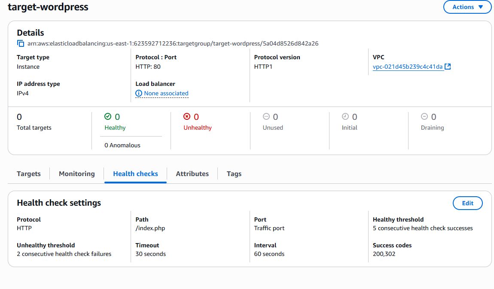

---

### 8. Criando Load Balancer
- Escolha para aplicação
- De um nome
- tipo internet-facing
- Escolha a VPC
- Adicione as subnets private-app 1a e 1b
- E o segurity group do ALB
- Escolhe o target group que criamos
- Mantenha o resto e crie.

---

### 9. Criando AutoScaling
- Nomeie o autoscaling e escolha o template que criamos

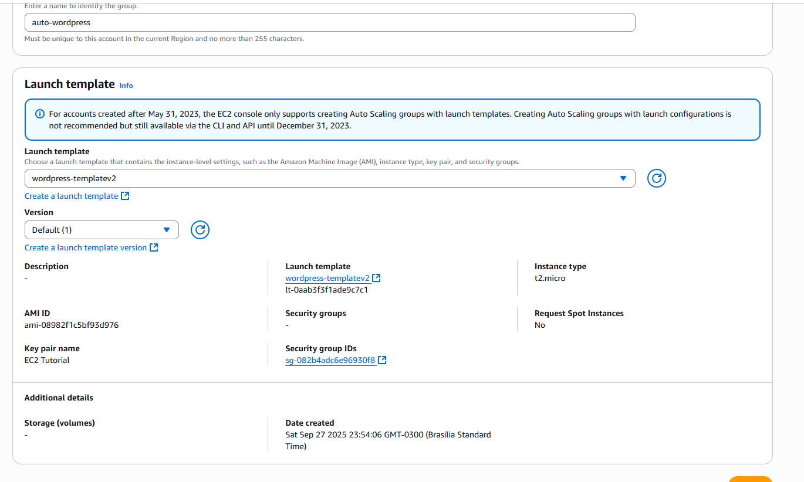

- Escolha a VPC e as subnets private-app

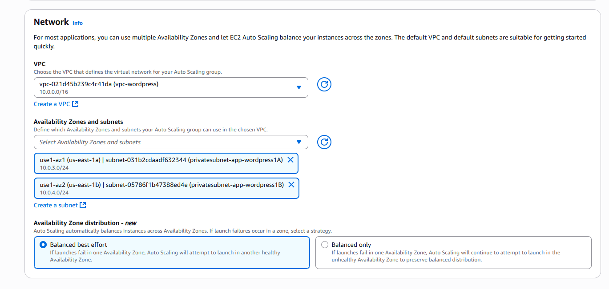

-Em Load Balancer escolha adicionar existe e coloque o target group criado

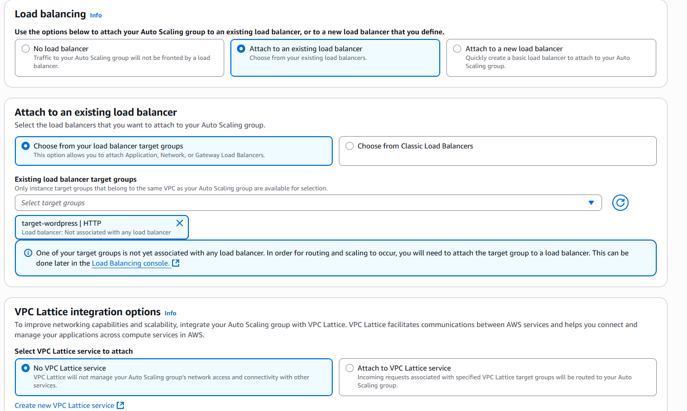

- Por fim coloque a capacidade desejada

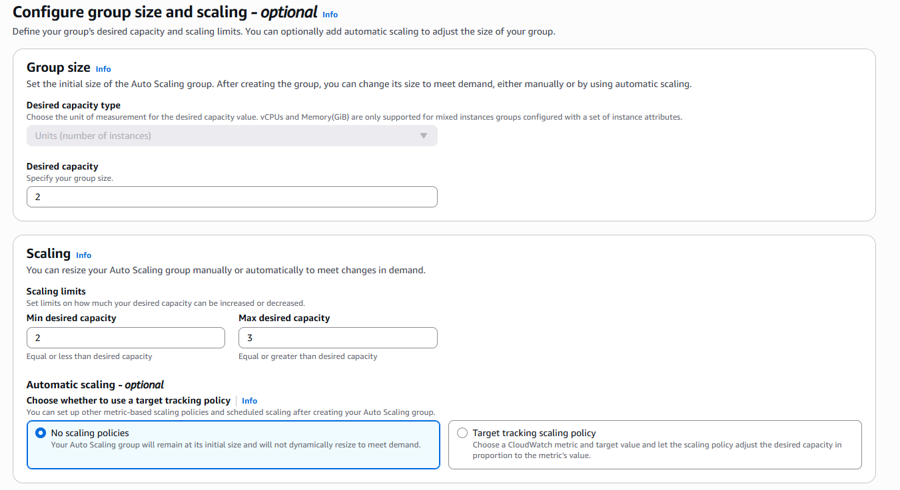

### Parabéns
Agora você pode consultar suas instancia criada em Instancias.
Sua aplicação é auto-escalavel e pode suportar muitos acessos de forma segura para todos

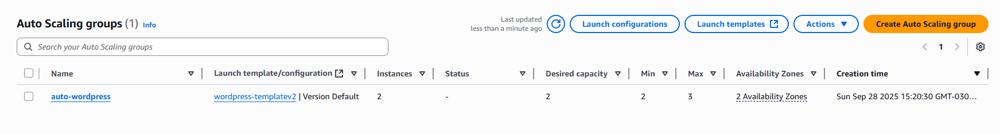

